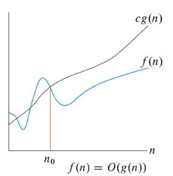
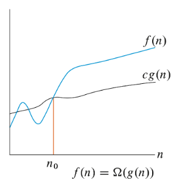
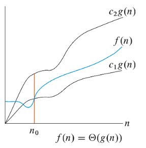

# Asymptotic

Asymptotic efficiency: worst case run-time with input size in the limit (going to infinity)
O Notation: Upper bound on the asymptotic effeciency of a function
    Function grows no faster than a certain rate
    Based on highest order
    (worst case)

Ω Notation: Lower bound on asymptotic effeciency of a function
    Function grows no slower than a certain rate
    Also based on higher order
    (best case)

Θ Notation: Tight bound on asymptotic effeciency
    Grows percisely at a certain rate 
    Highest order term
    if O(f) == Ω(f) then Θ(f)

Formal O notation: There exists constants so that 0 <= f(n) <= cg(n) where c is a constant for all n >= n0
    So if f(n) is 3n^3 - 5n + 7, O(n^3) also if f(n) = n then O(n^2) still holds
    Essentialy for O(g(n)), g(n) has to be same or higher degree than f(n)

Formal Ω notation: There exists constants so that 0 <= cg(n) <= f(n) for all n >= (n0)
    So if f(n) is 3n^3 - 5n, Ω(n^3)
    Essentially for Ω(g(n)), g(n) has to be the same or lower degree than f(n)

Formal Θ notation: There exists constants so that 0 <= c1g(n) <= f(n) <= c2g(n) for all n >= n0
