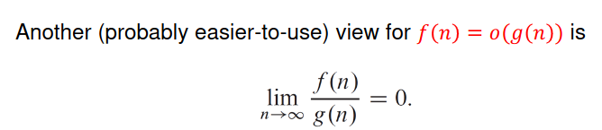
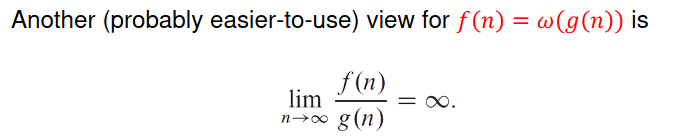
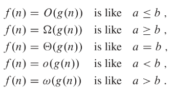
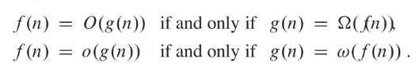

# Asymptotic 

* THe big takeaway is that Θ is a precise bound. 
* O(nlogn) isn't neccessarily faster than O(n^2) because the O(n^2) can be Θ(n)

## o-notation

* o is <  while O is <=
* If o(n) means that the runtime is strickly slower than n while O(n) means it is slower than or equal to n

* If f(n) = o(g(n)): g(n) > f(n)
  * If f(n) = O(g(n)): g(n) >= f(n)

## 𝜔-notation (Little omega)

* 𝜔 strict lower bound
* 𝜔 is > while Ω is >=

* If f(n) = 𝜔(g(n)): f(n) > g(n)
  * If f(n) = Ω(g(n)): f(n) >= g(n)

## Summary

## Properties

* Transitive property
  * If f(n) = O(g(n)) and g(n) = O(h(n)) then f(n) = O(g(n))
  * Applies to all 5 notations
* Symmetry
  * f(n) = θ(g(n)) if and only if g(n) = θ(f(n))
* Reflexive
  * f(n) = θ(f(n))
  * Works for all big notations
* Transpose symmetry

