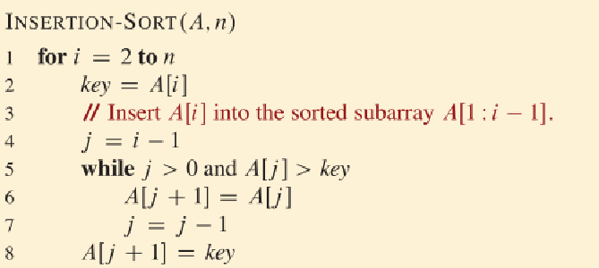

# 1 Sorting

## General Information
* Running time of algorithim of size n is denoted by T(n)
  * Depends on running time and nature of input
* To analyze running time we use RAM, each execution of each line takes Ck
* order of growth is only looking at the leading term of a formula O(n)
  * Even if the constant is larger for O(n^2) vs O(n), O(n) will always win if n is large enough

## Insertion sort
* Like sorting playing cards
* Start with an empty list
* Get each number from the unsorted list and put it in the empty list while staying sorted
 
* works because of *Loop Invariant*
  * At the start of each i in the outer for loop, the subarray A[1:i-1] is the elements in [1:i-1] but in sorted order
  * We need to prove 3 things
    * Initialization (base case): True before the start of the loop (true because one element is always sorted)
    * Maintenance (inductive step): If it is true before an iteration, it needs to be true after an iteration 
    * Termination: the loop terminates
  * Loop invariant is like an inductive proof
* Cost:

* Best case: Array already sorted while loop never ran (ti = 1) so T(n) is linear
* Worst case: Array in reverse sorted so while loop runs a lot (ti = i) so T(n) is quadratic

# Sorting

## Divide and Conquer

* Divide the subproblem recursively into tiny subproblems
* Solve the subproblems
* Combine all the subproblems to form a solution

## Merge Sort

* Divide the array into two subarrays
* Sort the subarrays recursively doing merge sort
* Once the subarrays is small enough sort it
* Combine it

* To merge the two sorted arrays, go through each element of L and R and just add the smallest element to the new array and move the pointer accordingly O(n) time

* Insert sort and merge sort used together because insert sort is faster in smaller arrays
  * Ex when there are <=4 elements use insert sort