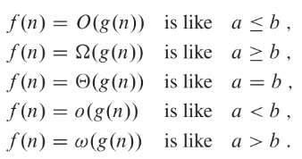

# Asymptotic

Asymptotic efficiency: worst case run-time with input size in the limit (going to infinity)
O Notation: Upper bound on the asymptotic effeciency of a function
    Function grows no faster than a certain rate
    Based on highest order
    (worst case)
	$O \ge$

Ω Notation: Lower bound on asymptotic effeciency of a function
    Function grows no slower than a certain rate
    Also based on higher order
    (best case)
	$\Omega \le$ 

θ Notation: Tight bound on asymptotic effeciency
    Grows percisely at a certain rate 
    Highest order term
    if O(f) == Ω(f) then θ(f)

Formal O notation: There exists constants so that 0 <= f(n) <= cg(n) where c is a constant for all n >= n0
    So if f(n) is 3n^3 - 5n + 7, O(n^3) also if f(n) = n then O(n^2) still holds
    Essentialy for O(g(n)), g(n) has to be same or higher degree than f(n)

Formal Ω notation: There exists constants so that 0 <= cg(n) <= f(n) for all n >= (n0)
    So if f(n) is 3n^3 - 5n, Ω(n^3)
    Essentially for Ω(g(n)), g(n) has to be the same or lower degree than f(n)

Formal θ notation: There exists constants so that θ <= c1g(n) <= f(n) <= c2g(n) for all n >= n0
	Essentially, same degree

* THe big takeaway is that Θ is a precise bound. 
* O(nlogn) isn't neccessarily faster than O(n^2) because the O(n^2) can be Θ(n)

## o-notation

* o is <  while O is <=
* If o(n) means that the runtime is strictly slower than n while O(n) means it is slower than or equal to n

* If f(n) = o(g(n)): g(n) > f(n)
  * If f(n) = O(g(n)): g(n) >= f(n)
$n^{2} \ne o(n^{2})$ just like $2 \not> 2$ 
## 𝜔-notation (Little omega)

* 𝜔 strict lower bound
* 𝜔 is > while Ω is >=

* If f(n) = 𝜔(g(n)): f(n) > g(n)
  * If f(n) = Ω(g(n)): f(n) >= g(n)

## Summary

## Properties

* Transitive property
  * If f(n) = O(g(n)) and g(n) = O(h(n)) then f(n) = O(g(n))
  * Applies to all 5 notations
* Symmetry
  * f(n) = θ(g(n)) if and only if g(n) = θ(f(n))
* Reflexive
  * f(n) = θ(f(n))
  * Works for all big notations
* Transpose symmetry

# Runtimes
$n! > c^{n} > n^{c} > (logn)^{c}$ where c is a constant and n is the size
Base of log does not matter $\log_{2}(x) == \log_{3}(x)$  
But degree of polynomial and base of exponential does matter 
	$3^{n}>2^{n}$
	$x^{3}>x^{2}$
	$(logn)^{3}>(logn)^{2}$
![[Pasted image 20240505163109.png]]