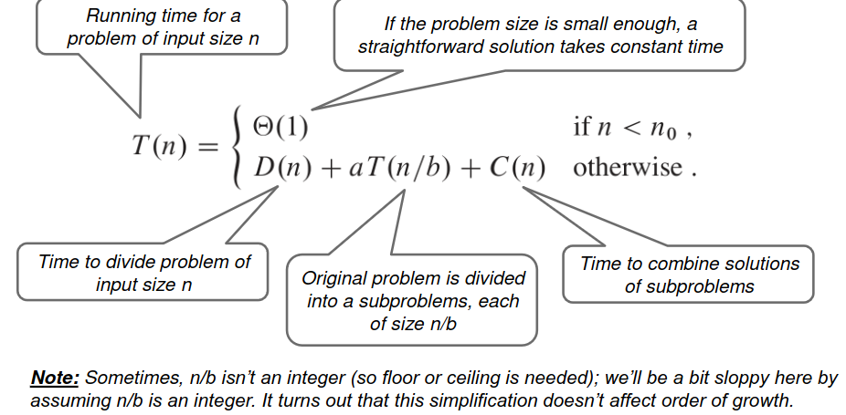
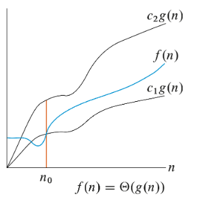
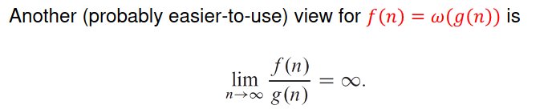
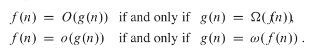

# Sorting

## General Information
* Running time of algorithim of size n is denoted by T(n)
  * Depends on running time and nature of input
* To analyze running time we use RAM, each execution of each line takes Ck
* order of growth is only looking at the leading term of a formula O(n)
  * Even if the constant is larger for O(n^2) vs O(n), O(n) will always win if n is large enough


## Insertion sort
* Like sorting playing cards
* Start with an empty list
* Get each number from the unsorted list and put it in the empty list while staying sorted
 
* works because of *Loop Invariant*
  * At the start of each i in the outer for loop, the subarray A\[1:i-1] is the elements in \[1:i-1] but in sorted order
  ![[Pasted image 20240505161401.png]]
  * We need to prove 3 things
    * Initialization (base case): True before the start of the loop (true because one element is always sorted)
    * Maintenance (inductive step): If it is true before an iteration, it needs to be true after an iteration 
    * Termination: the loop terminates
  * Loop invariant is like an inductive proof
	  * At the start of each iteration n, it has all the same elements originally in n but in sorted order
* Cost:


* Best case: Array already sorted while loop never ran (ti = 1) so T(n) is linear
* Worst case: Array in reverse sorted so while loop runs a lot (ti = i) so T(n) is quadratic
Insert sort is $\theta(n^{2})$ 
# Sorting

## Divide and Conquer

* Divide the subproblem recursively into tiny subproblems
* Solve the subproblems
* Combine all the subproblems to form a solution

## Merge Sort

* Divide the array into two subarrays
* Conquer: Sort the subarrays recursively doing merge sort
* Once the subarrays is small enough sort it
* Combine it

* To merge the two sorted arrays, go through each element of L and R and just add the smallest element to the new array and move the pointer accordingly O(n) time ![[Pasted image 20240505161740.png]]


![[Pasted image 20240505161816.png]]
![[Pasted image 20240505161828.png]]
* Insert sort and merge sort used together because insert sort is faster in smaller arrays
  * Ex when there are <=4 elements use insert sort
## Runtime
![[Pasted image 20240505161912.png]]
$\theta(nlogn)$# Asymptotic

Asymptotic efficiency: worst case run-time with input size in the limit (going to infinity)
O Notation: Upper bound on the asymptotic effeciency of a function
    Function grows no faster than a certain rate
    Based on highest order
    (worst case)
	$O \ge$

Ω Notation: Lower bound on asymptotic effeciency of a function
    Function grows no slower than a certain rate
    Also based on higher order
    (best case)
	$\Omega \le$ 

θ Notation: Tight bound on asymptotic effeciency
    Grows percisely at a certain rate 
    Highest order term
    if O(f) == Ω(f) then θ(f)


Formal O notation: There exists constants so that 0 <= f(n) <= cg(n) where c is a constant for all n >= n0
    So if f(n) is 3n^3 - 5n + 7, O(n^3) also if f(n) = n then O(n^2) still holds
    Essentialy for O(g(n)), g(n) has to be same or higher degree than f(n)


Formal Ω notation: There exists constants so that 0 <= cg(n) <= f(n) for all n >= (n0)
    So if f(n) is 3n^3 - 5n, Ω(n^3)
    Essentially for Ω(g(n)), g(n) has to be the same or lower degree than f(n)


Formal θ notation: There exists constants so that θ <= c1g(n) <= f(n) <= c2g(n) for all n >= n0
	Essentially, same degree



* THe big takeaway is that Θ is a precise bound. 
* O(nlogn) isn't neccessarily faster than O(n^2) because the O(n^2) can be Θ(n)

## o-notation

* o is <  while O is <=
* If o(n) means that the runtime is strictly slower than n while O(n) means it is slower than or equal to n

* If f(n) = o(g(n)): g(n) > f(n)
  * If f(n) = O(g(n)): g(n) >= f(n)
$n^{2} \ne o(n^{2})$ just like $2 \not> 2$ 
## 𝜔-notation (Little omega)

* 𝜔 strict lower bound
* 𝜔 is > while Ω is >=


* If f(n) = 𝜔(g(n)): f(n) > g(n)
  * If f(n) = Ω(g(n)): f(n) >= g(n)

## Summary


## Properties

* Transitive property
  * If f(n) = O(g(n)) and g(n) = O(h(n)) then f(n) = O(g(n))
  * Applies to all 5 notations
* Symmetry
  * f(n) = θ(g(n)) if and only if g(n) = θ(f(n))
* Reflexive
  * f(n) = θ(f(n))
  * Works for all big notations
* Transpose symmetry



# Runtimes
$n! > c^{n} > n^{c} > (logn)^{c}$ where c is a constant and n is the size
Base of log does not matter $\log_{2}(x) == \log_{3}(x)$  
But degree of polynomial and base of exponential does matter 
	$3^{n}>2^{n}$
	$x^{3}>x^{2}$
	$(logn)^{3}>(logn)^{2}$
![[Pasted image 20240505163109.png]]#  Recurrence 

## Substitution Method

2 general steps:
	1. Guess the form of the solution (prove O and Ω seperately)
	2. Prove by induction
```
Ex: T(n) = 4T(n/2) + n
Guess: T(n) = O(n^3)
Prove T(n) <= cn^3 by induction

= 4c(n/2)^3 + n
= c/2*n^3 + n
smth idk 
```

## Recursion Tree Method
Recursion tree models running time of recursion
	Each node represents the cost of a certain problem
	Sum costs of each level then sum all per level costs to get total cost
	This method is unreliable though
![[Pasted image 20240131093259.png]]
This gives an intuitive solution which could still be wrong

## *Master method*
Used to solve problems like: T(n) = aT(n/b) +f(n) where a>0 and b > 1
### Case 1:
You check to see if $n^{\log _b\left(a\right)}$ is bigger by a polynomial factor than f(n)
If true then: T(n) = $\theta$ ($n^{\log _b\left(a\right)}$)
Another way is to see if $n^{\log _b\left(a\right)-\epsilon} >= f(n)$ where $\epsilon > 0$
Ex: T(n) = 4T(n/2) + n
 $f(n)= n$ and $=n^{\log _2\left(4\right)-\epsilon} = n^1$ so $T(n) = \theta(n^2))$ 
 aka $n^{\log _b\left(a\right)} > f(n)$ if so then $\theta(n^{\log _b\left(a\right)} )$

### Case 2:
If case 1 can't be applied then you take $f(n)=n^{\log _b\left(a\right)}$ and multiply it by $\log n$ 
For this to work $n^{\log _b\left(a\right)} == f(n)$ 
Another note is that if the equation is  $T(n) = 4T(n/2)+ n^2*log^k(x)$, $k>= 0$  
Ex: 
$T(n) = 4T(n/2)+ n^2$   
$n^{2-1}$ is not $<= n^2$ so case 1 does not apply. 
$n^{2}== f(n) = n^2$ so Case 2 applies

Instead $T(n) = \theta(n^2logn)$  

 aka $n^{\log _b\left(a\right)} = f(n)$ if so then $\theta(n^{\log _b\left(a\right)} *logn)$ 
 Note: for this one you have to be vary of logn. If f(n) has logn you include it in the $\theta$ notation 
 If one of them is divided by logn, you cant use master method
 ![[Pasted image 20240504204357.png]]
### Case 3: 
Case 3 applied when $n^{\log _b\left(a\right)} < f(n)$ then $\theta(n) = f(n)$
Ex: 
$T(n) = 4T(n/2)+ n^3$   
$=n^{\log _2\left(4\right)} = n^{2} < n^3$ so $\theta(n^3)$ 


 aka $n^{\log _b\left(a\right)} < f(n)$ if so then $\theta(f(n))$  
## Binary Search
Find the middle
if middle is bigger, search left
else search right

$T(n) = 1*T(n) + \theta(1)$
$n^{\log _b\left(a\right)} = n^{\log _2\left(1\right)} = n^{0}= 1$  
$1 == f(n) = \theta(1)$ therefore we apply Master method case 2
Case 2: $T(n) = \theta(f(n)*\log n) = \theta(\log n)$  

## Strassen Method
Do more addition than multiplication
$T(n) = 7T\left(\frac{n}{2}\right) + \theta(n^2)$ 
$n^{\log _b\left(a\right)} = n^{\log _2\left(7\right)} = n^{2.807...}$ which is asymptotically better than $n^3$ 
![[Pasted image 20240504204518.png]]
# Randomized algos

## Hiring problem

* You are running an employment agency where you get sent a candidate a day for n days
* You interview and if they are better (ie higher) you immediately hire and fire the old one
* Cost to interview is Ci and cost to hire is Ch assume Ch > Ci
* Total Cost: O($C_{i}n+C_{h}m$)
![[Pasted image 20240205091230.png]]
Worst case ex1 so hiring cost is O($C_{h}n$)
### Probabilistic analysis
Assume random order
We have to enumerate all possible inputs, get running time, get average
	Difficult to apply
We can also use indicator random variable
	Analyze the average contribution to each member of the input to the total running time/cost and then sum it up
	Converts probability to expectations
![[Pasted image 20240205092056.png]]	

For candidate i= n, P(getting hired) = 1/i since theres a 1/i chance that it is bigger than the previous element
![[Pasted image 20240205093813.png]]
Therefore the time complexity for average case hiring is $c_{h}logn$

![[Pasted image 20240505164547.png]]

## Analysis of randomized algorithim
* Probabilistic analysis of a deterministic algorithim
	* Input is random
	* Always same running time
	* Average case running-time
* Randomized algorithim
	* Input is anything and then we randomize
	* Expected running time over input
	* Randomizing is O(n)

How to permute? Uniform random permutation. Go thru each index and swap it with a random index
# Quicksort

Divide: Partition A into 2 subarrays such that all elem A\[mid:] $\le$ A\[mid] and A\[:mid] $\ge$ A\[mid]
Conquer: Sort by recursing
Combine: No need since it is in place
![[Pasted image 20240207111355.png]]
Partitioning: Selects the pivot point and rearranges the elements of the array between the pivot point (less is to left, more is to right)
![[Pasted image 20240207112035.png]]

![[Pasted image 20240505165043.png]]
![[Pasted image 20240505165052.png]]
![[Pasted image 20240505165106.png]]
## Time complexity
Depends on partition
If the list is completely unbalanced the sorting time is $\theta$(n^2) because the amount of recursion is n (one recurse has 0 the other has n-1)
Best case is  is $\theta$(nlogn) because the partitioning is even so it recurses logn times:
$T(n) = 2T(\frac{n}{2}) + \theta(n)$   => master method => $n^{\log_{2}2} = n^{1}= n$ => case 2 => $\theta(n*logn)$ 
Average case is also the same. We can use indicator random variable to get a random list and avoid the worst-case
Can use median of multiple numbers as the pivot number if needed 

Can also randomize list or randomize the partition# Heap
## Heap
Array that can be viewed as a binary tree
Each row is filled except the last row

Parent index = i // 2
Left child = 2i
Right child = 2i + 1

Height: logn

Max_heap: Largest element at the top (root), parent always more than children
Min_heap: Smallest element at the top (root), parent always less than children

### Max Heapify
Recursive procedure that maintains the max_heap property
![[Pasted image 20240209094540.png]]
Running time is O(logn) because you do it for each level in the height

Build max heap calls max heapify for every element
![[Pasted image 20240209094804.png]]
Runtime is O(nlogn) but a tighter analysis says that it is O(n) since it isn't called for half the leafs

## Heapsort
Makes a heap based on an unsorted list
![[Pasted image 20240209111008.png]]
**Loop Invariant** At the start of each iteration, A\[1:i] is the smallest i elements while A\[i+1:n] is the n-i largest elements in sorted order

Worst case runtime: O(nlogn) because to build the heap you have to iterate n times and to heapify it is logn so to build the heap the runtime is nlogn
![[Pasted image 20240505171303.png]]

# Comparison sort
Sort elements by comparing the two numbers
Includes: insertion, merge, quick, heap
Other forms exist like counting sort, radix sort, and bucket sort

Any comparison sort algo has a worst case runtime of $\Omega(nlogn)$ 
	Heapsort and merge sort are asymptotically optimal because their worst case is O(nlogn) unlike the others whose worst case is $O(n^2)$ 
![[Pasted image 20240505171428.png]]

# In place sorting
Algorithm is called in-place if the input array is directly sorted and a new one doesn't need to be created they have $\theta(1)$ additional space so it has space efficiency
	Insert
	Heapsort
	Quicksort (needs O(n) or O(logn) additional space in memory for recursive calls)
Out-of-place algorithms require a new array to be created for the sorted elements thus needing $\theta(n)$ extra space to sort an array

# Priority queue
Application of heap (both min and max) with 4 functions:
	1. Insert(element, key): adds an element O(logn) because heapifying takes logn and adding an element takes O(1) ![[Pasted image 20240212162348.png]]
	3. Max/min(): returns the max/min value $\theta(1)$ ![[Pasted image 20240212165330.png]]
	4. extract(): returns and removes max/min value $O(logn)$ because need to heapify ![[Pasted image 20240212165445.png]]
	5. Increase-key(element, num): Increases the value of element x's key to num $O(logn)$ since it takes logn to heapify and assuming O(1) to find the elem ![[Pasted image 20240212162204.png]] 
![[Pasted image 20240505171623.png]]
Ex: *Scheduler*: Scheduling jobs on a computer with different deadlines/priorities
	Heap keeps track of jobs to be executed and their priorities
	When a job is finished it grabs the next task by doing extract()
	When a job is pending for a while you can do Increase it
	Can add an additional job by doing insert
# Data Structures
## Sets
Collection of values 
Can be manipulated by algorithms and changed (insert, delete, search, etc)
Attributes of a dynamic set:
	key: used to identify the object 
	Satellite data: Other information about the object that is more general
	Other data: Pointers to other objects
Some dynamic sets assume there is some resemblance of order in a set
Dynamic Sets examples:
	arrays, stacks/queues, graphs, linked lists, skip lists, trees hash tables, disjoint sets

## Set operations
1. Queries: return information about the set
2. Modifying operations: Change the set
Time to do the operation is measured in terms of the set being of size n

## Array
Continues sequence of memory space
Matrix are just two dimensional arrays but they can be represented as one continues block of memory
Single array: more efficient
Multiple array: more flexible 
takes $\theta(1)$ to access any matrix element directly 

### Matricies 
2d arrays, can be represented like 1d array in row major or column major 
Ie if 
$$
\begin{matrix}
1 & 2 & 3 \\
3 & 5 & 6
\end{matrix}
$$

it can be represented \[1,2,3,4,5,6] or \[1,3,2,5,3,6] (column major)
single array is more efficent but multiple array is more flexible. Either way access $\theta(1)$ 
## Stacks/Queues
Dynamic sets where insert and remove is prespecified
Stacks: Last in first out
	Insert is called push 
	Delete is called pop
	Can be implimented with an array that is \[1:n] elements long
	S\[1] is the bottom element of the stack while S\[n] is the top element 
	if stack is full then location of S.top = size
	![[Pasted image 20240505172528.png]]
	![[Pasted image 20240214093010.png]]
	All 3 operations are $\theta(1)$
Queues: First in first out
	Insert is called enqueue
	Remove is called dequeue
	Needs one element of buffer so n -1 can be implemented as S\[1:n]
	Q.head is the start of the queue, next to be removed
	Q.tail is the end of the queue, the last element that was added
	Q.size is the max capacity of the queue + 1
	A queue is circular, it wraps around, so if Q.head == Q.tail == index 1 then it is empty
	Full queue is if the Q.head == 1 and Q.tail position == Q.size or Q.head=Q.tail+1
	![[Pasted image 20240214093805.png]]
	Time complexity is $\theta(1)$ 
![[Pasted image 20240505172823.png]]	
## Linked Lists

Data structure in which elements are in linear order but connected via pointers
Singly Linked list: Each element points to the next element
Doubly linked list: Each element points to the previous and next element

**<mark style="background: #FF5582A6;">Doubly linked list</mark>**
Each element has key and 2 pointers, next and prev
	Next points to successor
	Prev points to predecessor
	If next points to NIL then last, if prev points to NIL then first
	Head points to First element (NIL if empty)
### Searching
Start with the first element and keep doing element.next
![[Pasted image 20240219113806.png]]
$\theta(n)$ time
### Inserting
Prepending (adding to the front) takes $\theta(1)$ time
![[Pasted image 20240219113929.png]]
Inserting (adding anywhere in the list) takes $\theta(1)$ time
Takes element to add and where to add it
![[Pasted image 20240219114037.png]]
![[Pasted image 20240505173212.png]]
### Deleting
Remove an element from a linked list
Takes element that needs to be deleted
$\theta(1)$
![[Pasted image 20240219124520.png]]
![[Pasted image 20240505173242.png]]
## Sentinels
Dummy element that allows simplification of boundary elements 
In linked lists, all NIL elements are replaced by sentinel NIL
![[Pasted image 20240505173308.png]]
It turns a regular linked list circular because both the front and the back are pointing to the same NIL sentinel
Useful because it simplifies the code quite a bit because it reduces edge cases and can sometimes slightly make it faster
![[Pasted image 20240505173330.png]]
![[Pasted image 20240505173350.png]]
If there are many linked lists it is extra space but also very slight speed increase

## Array vs Linked lists
Arrays are easier
Linked lists are more flexible
![[Pasted image 20240219131839.png]]

## Runtime of linkedlist
Insert run time is O(n) because in LL you have to traverse the entire list just to find the element to add
Delete and search run time is O(n) for same reason
![[Pasted image 20240221113536.png]]
Skip Lists aid this by reducign the search time to O(logn)
# Skip Lists
Randomized data structures built upon sorted linked lists but insert, delete, search done in O(logn) instead of O(n)
Skip lists have multiple sorted lists and some elements appear more than once which are connected via vertical links
![[Pasted image 20240221111842.png]]
Kind of like an express lane in an highway

## Search
If there are n elements in the list, there should be $\sqrt{n}$ elements in the list above it (call it m)
The cost of search becomes m + n/m or $\sqrt{n} + \frac{n}{\sqrt{n}} = 2\sqrt{n}$  
![[Pasted image 20240221112434.png]]
In each row at most 2 elements are accessed
So time complexity becomes O(logn)

## Delete/Insert
Removing and adding elements may disturb the structure of the skip list
### Delete
Find the element and delete it and delete it from all of the "super"lists that contain it
![[Pasted image 20240221113050.png]]
Delete both
### Insert
Always insert at the bottom list
Then flip a coin on whether it is put onto the next level (50% chance to add to lane above)
You keep doing the coin toss for moving the node above until it is at the top list or until the flip is tails and you don't add it

![[Pasted image 20240505174831.png]]
More dynamic that sorted arrays, more memory effecient than trees
Good for parallelism 
Simple
Approx queries are faster
# Trees
Data structure without linear relationships
Each node of a tree is an object with a value and a pointer
2 types of trees:
	Binary tree: each node has at most 2 children
	Unbounded trees: Each node has any number of children

## Depth vs Height
<mark style="background: #FF5582A6;">Depth</mark>: Simplest path from root to the node
<mark style="background: #FF5582A6;">Height:</mark>: Longest simple path from node to a leaf
![[Pasted image 20240505175519.png]]
# Unbounded tree
3 different pointers:
	x.p points to parent node
	x.left-child points to the left-most child (not necessarily left child)
	x.right-sibling points to the node to the right (not right child but literal right node)
![[Pasted image 20240505175610.png]]
# Binary Trees
Each node has 3 pointers
	x.parent points to parent node (if NIL then root)
	x.left points to left node (if NIL then no left child)
	x.right points to right node (if NIL then no right child)
There is an additional T.root that points to the root of the tree

## Binary Search Trees
Binary tree where for every node, the left subtree is smaller and the right subtree is bigger
### tree walk
All tree walks Take $\theta(n)$  since it is called twice for each node and each call is $\theta(1)$ 
<mark style="background: #ADCCFFA6;">In Order</mark>
We can print the BST in order using a recursive algorithm
![[Pasted image 20240219133509.png]]
<mark style="background: #ADCCFFA6;">Pre order</mark>
Print, left, right
Used for recreating the same subtree
<mark style="background: #ADCCFFA6;">Post order</mark>
Left, right, Print
Used for deleting the subtree

### Searching
Searches for a given key by going left or right from the current node starting from the root
O(h) (h is height) time because worst case is a linear tree, $\theta(logn)$ is average case like a binary search
![[Pasted image 20240219151810.png]]
Recursion is more intuitive but Iteration is more efficient

### Min/Max
Searches for min or max of a tree by going left until no more or right until no more
Same time complexity as above

### Successor/Predecessor
O(h) running time
For any given node x, 
	Successor is the next node in the <mark style="background: #FF5582A6;">IN ORDER TREE WALK</mark>
		Done by finding the min (leftmost node) in the right subtree OR (if RST DNE) climb up the tree until the first right turn
		![[Pasted image 20240219152628.png]]
	Predecessor is the prev node in the <mark style="background: #FF5582A6;">IN ORDER TREE WALK</mark>
		Done by finding the max (rightmost node) in the left subtree OR climb up until go left
		In fig below, change right to left, min to max
		![[Pasted image 20240219152844.png]]
### Insert
Insert a new key by tracing a simple path down following the normal rules
O(h) worst case and $\theta(logn)$ average
![[Pasted image 20240219153026.png]]

### Delete
Deletes node from tree with 3 cases
1. No left child: Replace node with its right child (could be NIL)
![[Pasted image 20240505180231.png]]
2. If there is a left child and no right child, replace with it's left chld
![[Pasted image 20240505180318.png]]
3. If there is both children, find z's successor (min in RST) and replace z with it
![[Pasted image 20240505180456.png]]
![[Pasted image 20240505180531.png]]
and recurse
![[Pasted image 20240505180701.png]]
Runtime: $O(h)$ since everything is $\theta(1)$ except Minimum


## Runtime of BST
O(h) for all operations where h is the height
Thus best case (balanced) is $h = \theta(logn)$  
Worst case (linear) is $h=\theta(n)$ 

Balanced trees:
	AVL trees: heights of two child subtrees differ by at most 1
	Red-black tree: Each node has a color bit (red/black) to reorg and balance tree
![[Pasted image 20240505181006.png]]

### Rotation
Balanced Trees have them to  maintain h = logn and BST property
![[Pasted image 20240505181058.png]]
Any modifying operation must have them so that it is balanced (somtimes >1) 
![[Pasted image 20240505181210.png]]

# Hash Table (dict)

Supports dictionary operations (Insert, delete, Search)

Assume:
	Each element has a unique key and other data (like a row in a db)
	If the size of the hash table is m, the hash table is size T\[0:m-1]

## Direct addressing
Works well when universe of keys (all usable keys) is small 
Suppose Universe of keys U = {0,1,2,...m-1}
Each slot corresponds to key in the univ
	T\[key] points to satellite data
	T\[key] points to nil if there is no key k
Insert, delete, search is all O(1)
The downside of this is that if U is super large, then it becomes impractical with too much wasted space since keys needed could actually be pretty small 
![[Pasted image 20240304113319.png]]

Ex: KU IDs (7 digit num). The universe of keys is 10,000,000 (10^7) but that much space isn't needed and most of it would be wasted

## Hash table
More effecient when set of actual keys is much smaller than the universe of all possible keys
Size of hash table is m = O(n)
Uses hash func to compute slot number
![[Pasted image 20240304113255.png]]

### Collision
Happens if 2 keys go to the same slot
Hash tables try to avoid this by choosing a good hash function or resolving collisions if they do occur
Ideal hash function will have an equal probability to hash into each slot for any given k. It is random, uniform, and independent (indpendent uniform hashing)
	Each k is equally likely to hash to any of the slots 

Hash table with the ideal function is called independent uniform hashing
	Hard to implement so we aprox to the ideal

# Hash Schemes
Load factor $\alpha = n/m$ where n is elements and m is slots
## Static hashing
Single, fixed hash function so the same input will be hashed to the same spot
Very vulnerable to worst case behavior

Worst case $\theta(n)$, elements chosen maliciously
Average case: $\theta(a)$ where $a=n/m$ which is the load factor or number of elements in each slot, elements chosen randomly

### Division method
h(k) = k mod m
Works well when m is a prime number
Many keys can hash to the same slot so like if m = 7 then 8, 15, 22 all hash to 1
### Multiplication method
$h(k)=\left\lfloor m (kA\mod 1) \right\rfloor$  where  0 < A < 1
The mod 1 removes the integer part so like 4.5 % 1 = .5 and the floor then removes the fraction
m does not need to be prime

## Random hashing
Introduce randomization to reduce collisions
Family of hash functions {h1, h2,...hn} are used
If you have 2 keys k1 and k2, h1 will hash k1 and h2 will hash k2 but any malicious adversary will not know which one is used
$\theta(a)$
### Universal hashing
Special case of random hashing
Family of hash functions is called universal if it satisfies the universality property:
	For distinct k1 and k2, the amount of hash functions that will put them in the same spot is <= |H|/m
	If we randomly pick h from H and the probability that h(k1) = h(k2) is 1/m
![[Pasted image 20240304124819.png]]

## Perfect Hashing
Perfect hashing guarantees 0 collision
Only works for an unchanging set of n elements 
Simple and two-level schemes used

### Simple Scheme
Performs following procedure to remove collision
	1. Construct hash table of $n^2$
	2. Chose a universal family of H hashing functions
	3. **LOOP**
		1. pick a function $h \in H$ uniformly at random
		2. Use h to hash n elements into the table
	4. **UNTIL** No collision for the n elements
Trial are the steps in between LOOP and UNTIL
~2 trials to find success

### Two level Scheme
Two-level perfect hashing has two levels of tables with universal hashing at both levels
First level is m=n (collisions exist)
Second level has different sizes for each slot in the first level so collisions don't exist
	Second level size of first level + square of the collided elements
![[Pasted image 20240505182958.png]]

![[Pasted image 20240304133822.png]]

# Collision reduction

Even with good functions, multiple elements could go to the same spot
2 techniques to reduce:
	Chaining
	Open addressing

## Chaining
Use linkedlist for all elements that hash to the same slot
slot n points to the start of the linked list or NIL
![[Pasted image 20240308190139.png]]
In this case, insert/delete take $\theta(1)$ time
Search:
	Worst case search is $\theta(n)$ (all elements hash to the same spot)
	Average search is $\theta(1+a)$ where a is the load factor 
	If $\alpha = 1$ or n = m then search is $\theta(1)$ 
## Open addressing
Stores all elements in the hash table itself
Each entry only has one element or nil
Load factor can never be $\ge$ 1
Collisions handled by continiously probing (going through) different slots of the table
	Insert: Keep going (probing) till an open spot is found
	Search: Keep going until an the element is found (success) or empty spot (fail)

For each key *k*, a probe sequence, h(k,i), is used
	1. h(k,0)
	if h(k,0) exists, then
	2. h(k,1)
	3. h(k,2)
	4. h(k,3)
	5. ...
	Example:
		Lets say you are trying to insert 10. h(10,0) = 2 but key 2 is already taken so then you do h(10,1)= 5 which is also taken. Then h(10,2)...you continue until all spots are checked or an empty spot is found.
![[Pasted image 20240308191230.png]]

![[Pasted image 20240505183412.png]]
Probing strategy has a hash function h(k,i) where k is the key and i is the probe number


#### Linear probing
$h(k,i) = (h_{1}(k) + i) \mod m$ where $h_{1}(k)$ is the hashing function
This allows the function to go to the next position and then wrap around until i == size of table 
![[Pasted image 20240308191640.png]]
It is easy to implement and good cache perf but also leads to clusters which slows everything down


#### Double Hashing
$h(k,i) = (h_{1}(k) + i*h_{2}(k)) \mod m$   Where h1 and h2 are both auxillary hash functions
	Note: m is prime and h2 returns a val < m in order to cover full table
	If h2(k) = 1, it becomes linear probing
Probe sequence:
![[Pasted image 20240308191958.png]] ... mod m
![[Pasted image 20240308192038.png]]
### Runtime of open addressing
Assumes:
	Uniform hashing: Each key is equally likely
	Load factor < 1: # elements < # slots
Unsuccessful search: 
	Worst case: $\theta(n)$ searches all slots
	Average case: $\frac{1}{1-a}$, if $\alpha$ is constant then $\theta(1)$ 
	![[Pasted image 20240505183842.png]]
Successful search: More complex but faster since it usually means it isn't there if it is taking long


Insert: Same time as unsuccessful search because finding empty slot
Delete:
	Takes $\theta(1)$ but tricky because search might depend on the element
	You sometimes have to mark it is DELETED so search continues but the load factor is messed up then
<mark style="background: #FFB86CA6;">Another way is to rearrange the table after the delete so that the elements don't depend on a vacated space and the load space is still applicable</mark>
![[Pasted image 20240308192713.png]]
	
# Disjoint sets
* Set: Collection of numbers/elements
* Disjoint if two sets have nothing in common
	* I.E $x_{1} \cup x_{2} = \emptyset$  
## Disjoint-set (Union-find) data structure
* Maintains a collection of disjoint sets
* Each set has a representative which is used to identify the set (chosen element is arbitrary) 
### Operations
Make-set(x): Create a new set with whose only member (and rep) is x
Union(x,y): Merge x and y
Find-set(x): Return the representative of the set with x
Scenario:
	Make-set is called n times to create n sets with 1 element
	m operations of UNION and FIND-SET are performed (m - 1 unions)
Important for finding connected components of an undirected graph or minimum spanning tree of a weighted graph

### Linked List representation
Each set has its own linked list with elements of the set (order doesnt matter)
Set object points to tail and head
Each set has two pointers, next and set pointer (points back to set object)
Representitive of each set is the first element of each list
Essentially a singly linked-list of linked-lists
![[Pasted image 20240320105115.png]]

<mark style="background: #FF5582A6;">MAKE-SET(x)</mark>: Create a new linked list with element x $\theta(1)$
<mark style="background: #FF5582A6;">FIND-SET(x)</mark>: Follow the pointer from x to the set object then return the object that the head points to. $\theta(1)$
<mark style="background: #FF5582A6;">Union(x,y)</mark>: Append y's list to end of x and update all of the pointers (the ones pointing to the set). $\theta(len(y))$ because all of y has to be updated
	This union always appends the second element to the first
	If there are n elements and you are always appeneding longer list to the shorter one (worst case), then it is $\theta(n^2)$ because each element is appeneded n times. $O(m+n^{2})$
	![[Pasted image 20240504232458.png]]
<mark style="background: #FF5582A6;">Weighted-Union(x,y)</mark>: Always appends shorter list to the longer one
	.<mark style="background: #CACFD9A6;">	O(nlogn)</mark>


### Tree Representation 
Each set is a rooted tree where each node is an element
Each node has one pointer which points to parent (root points to itself and is representative)
![[Pasted image 20240320111311.png]]

<mark style="background: #FF5582A6;">MAKE-SET(x)</mark>: Create a new tree with element x $\theta(1)$
<mark style="background: #FF5582A6;">FIND-SET(x)</mark>: Follow pointers from x up to the tree root $\theta(d)$ d = depth
	In the picture, FIND(e) returns c and find(g) returns f
<mark style="background: #FF5582A6;">UNION(x,y)</mark>: Makes root of second tree (y) point to root of first (x)
	Runtime of $\theta(max(d_{1}, d_{2}))$ where $d_{1}$ and $d_{2}$  are depths of x and y because it takes $\theta(d)$ do FIND-SET 
	![[Pasted image 20240320112219.png]]
	This always makes second point to first so if you had m UNION (and thus m FINDSET), the worst case is a linear line thus making the total runtime O(mn) or O(n^2) (having to do findset n times that takes $\theta(n)$ each)
<mark style="background: #FF5582A6;">Union by rank</mark>: Root of tree with smaller rank (depth) points to root of tree with higher rank
	Rank is increased by 0 (if ranks are different) or 1 (if ranks are same)
	In a sequence of union and find set:
		Rank is always logn
		Find-set and union is O(logn)  because that's the depth so the total runtime of m unions is O(mlogn)
<mark style="background: #FF5582A6;">Union by size</mark>: Instead of keeping track of depth you keep track of amount of nodes. the root of the tree with less nodes points to the root of the tree with more nodes
	Both work well but in practice rank is easier


## Path Compression
In FIND-SET, Path compression makes each node in the path to the element point to the root
![[Pasted image 20240320113919.png]]
Total runtime for Union by rank and path compression is $O(m\alpha(n))$ where $\alpha(n)$ is a really slow growing function so the time complexity is essentially (but not technically) O(m) (linear)
![[Pasted image 20240320172957.png]]

# Graphs
Represent set of objects where some pairs are of objects are connected
G = (V,E)
	V = Vertex Set with all Verticies/Nodes
	E = Edge Set with all edges (connections between nodes)
Runtime is measured by size, |V| = numbers of vertices and |E| = Number of edges
Directed or Undirected graphs

# Terminology
## Adjacency 
Given an edge (u,v), u is <mark style="background: #FF5582A6;">adjacent</mark> 
	If the graph is undirected, the adjacency relation is ALWAYS symmetric
	If the graph is directed, the adjacency relations is sometimes symmetric (1,2 and 2,1 for symmetry)

## Degree
The degree of a vertex is the amount of edges connected from/to it
	If the graph is undirected, It is the number of vertex connected to the node
		The sum of degrees is double the amount of edges
	If the graph is directed:
		The <mark style="background: #FF5582A6;">in-degree</mark> is the number of edges entering the node
		The <mark style="background: #FF5582A6;">out-degree</mark> is the number of edges leaving the node
		Degree is the sum of the two
![[Pasted image 20240328134357.png]]
Left figure: Node 2 has degree 2
Right figure: Node 2 has in-degree 2, out-degree 3, degree 5

Lemma: If a graph is undirected, the sum of the degrees of all verts is 2\*number of edges

# Directed Graph (Diagraph)
The edge set E has a set of directed edges
	(u,v) means u goes to v
	$(u,v) \ne (v,u)$ 
	(u,u) is a self loop 
![[Pasted image 20240328133558.png]]
Adjacency-list representation:
	Array of |V| elements where each element is a vertex and points to a linked list of all the verticies it is adjacent to
	Total length of all linked lists is |E| 
	Storage: $\theta(V + E)$
Adjacency-matrix representation:
	Same as directed graph
	Not always symmetric though
	Storage: $\theta(V^2)$
![[Pasted image 20240328141327.png]]
# Undirected graph
Each edge goes both ways
Adjacency-list representation:
	An array of |V| elements where each element is a vertex and points to a linked list of all of the verticies it is adjacent to 
	Total length of the linked lists is 2*# of edges (|E|)
	Storage: $\theta(V + E)$
	Number of verts + edges which checks out 
Adjacency-matrix representation 
	|V| \* |V| matrix where all numbers are 0 unless there is an edge which then it becomes 1
	Symmetric for undirected 
	Storage: $\theta(V^2)$
![[Pasted image 20240328140155.png]]


# Weighted Graphs
Graph but each edge has an associated weight
Adjacency-list representation: 
	Each element of linked-list stores the weight as a var
Adjacency-matrix:
	Each element of matrix stores the weight ($\infty$ if not adjacent)

# Graph search
Searching a graph involves following the edges to visit all the vertices 
Discovers structure of graph 
2 algortithms:
	Breadth-first Search (BFS): For minimum spanning trees and shortest path
	Depth-first Search (DFS): For topological sort and strongly connected components 
	
## BFS
Given a graph, a source vertex *s* is chosen arbitrarily and every edge of the graph is explored to discover every vertex *v* reachable from s
The distance (smallest number of edges) from s to every v is computed
Supposed to "expand the frontier" between discovered and undiscovered vertices 
![[Pasted image 20240328151813.png]]
Vertices discovered in waves from source until all verts are found
Wave 1 = all verts with distance 1 from s, Wave 2 = all verts with distance 2 etc
SINGLE FIFO Queue to keep track of the frontier of the waves

### Implementing
White nodes: Undiscovered nodes, all start as white
Gray nodes: Vertex discovered for first time (in frontier) 
	Vertex changed from white to gray
	Enqueued
Black: Vertex is behind the frontier
	Changed when dequeued 
	Followed by discovering all neighbors 
When a white vertex *v* is discovered from a grey vertex *u*, u is the predecessor/parent of v
BFS has 3 attributes for each vertex
* v.color: Color of vertex (default white)
* v.d: Distance from source vertex (default $\infty$)
* v.p or v.$\pi$: parent vertex (default NIL)
When discovered for the first time, v.color = grey, v.d = u.d + 1, v.p = u
![[Pasted image 20240328153414.png]]
Run time is $\theta(V+E)$: Lines 1-4 take $\theta(V)$, lines 12-16 take $\theta(E)$ 
Each vertex is enqueued once and dequeued once (why $\theta(V)$) 
![[Pasted image 20240505000037.png]]
![[Pasted image 20240505000053.png]]

## DFS
![[Pasted image 20240505000655.png]]
Starts from any index and searches deeper before backtracking to search for other vertices, kind of like a BST print
Uses same 3 colors 
	White: Undiscovered
	Grey: DIscovered for the first time
	Black: Finished, All neighbors in adjacency have been completed and explored
2 timestamps are also stored to be used later
	v.d: When first discovered (colored grey)
	v.f: When finished (colored black)
	v.d < v.f
![[Pasted image 20240505000943.png]]
![[Pasted image 20240505001002.png]]
![[Pasted image 20240328155105.png]]
Psuedocode: 
![[Pasted image 20240328155129.png]]
Running time: $\theta(V+E)$ 1-6 in DFS Once per visit so $\theta(V)$ and 5-6 in visit is $\theta(E)$ 


# Paths and cycles
In a directed graph , 
	Path: length of a sequence of verts that are connected by edges
		Path (1,2,4,5) with length 4
	Cycle: A path where the first and the last element are the same
		Note: must have 1 edge in the path
		Cycle: (1,2,4,5,1)
![[Pasted image 20240328164908.png]]

<mark style="background: #FF5582A6;">Directed acyclic graph (DAG)</mark>: Directed group with no cycles

# Topological sort
Linear ordering of all vertices of a DAG so that if there is an edge (u,v) then u appears before v in the ordering
Note:
	Sort for a DAG ONLY
	Not the same as other sorting algorithms

Used to sequence tasks with dependencies 
![[Pasted image 20240505001822.png]]

DFS can be used to do it in $\theta(V+E)$ time
![[Pasted image 20240328165353.png]]
Verts will appear in the reverse order of finish times (v.f)
Intuition: If a vertex is finished (colored black) then all of its dependencies must be finished (colored black)

# Connected components
(undirected graph)

A vertex is <mark style="background: #FF5582A6;">reachable</mark> if there is a path from another vertex to itself
Connected component: Subset of vertex set in which all verticies in the subset are reachable from each other
Connected: Only one connected component G = V where G is the connected component

## Method 1: Graph search
1. BFS/DFS starts with some vertex s and discovers all verts discoverable by s thus making a connected component 
2. If there are more verts t, discover all verts reachable by t creating another connected component
3. Repeat
$\theta(V + E)$ same as BFS/DFS

## Method 2: Disjoint Set 
3 methods: Make-set, find-set, and union
1. Algorithim makes a new set for each vertex
2. Merge the sets for each edge
3. Repeat till all sets are found
$\theta(V+\alpha(V)E)$ where $\alpha(V) \le 4$ for most graphs (find-set time complexity)
![[Pasted image 20240328170739.png]]
# Free Tree
Graph that is undirected, Connected, and acyclic.
	If it is unconnected, then it is a forest
Free tree always has these properties:
	Two verts connected by a unique simple path (path where all verts are distinct)
	E = V -1
	If any edge is removed, then the graph is unconnected 
	If any new edge is added, then there's a cycle

## Spanning tree
In a graph that is connected and undirected, a spanning tree is a free tree that has all the verts in the original graph as well as a subset of edges
![[Pasted image 20240505123243.png]]

# Weighted graph
Connected undirected graph with a weight function that has the cost of each edge
The MST is a spanning tree with the least total cost in the set A of edges
	May not be unique
The minimum spanning tree *T* has the same vertex set as the graph so it is only represented by the edge set 
![[Pasted image 20240401111918.png]]

## Finding MST
Kruskal's algorithm and Prim's algorithm
Both are greedy algorithms (make local optimal decisions) and guarentee finding the MST

### Generic method
Cut:
	Cut (S, V-S) is a partition of G's vertex set into two disjoint subsets S and V-S
	Ex: Orange and tan verts
Cross:
	An edge *$(u,v) \in E$*  is a cross if one of its edges points to S and the other points to V-S
	Ex: (a,h)
Respect: 
	A cut respects a set of edges *F* if no edge in set F crosses the cut
	Ex: The cut respects the set of blue edges
![[Pasted image 20240401200952.png]]
Start with empty tree and grow the MST by adding one "safe edge" at a time
Safe edge (all reasons must be satisfied):
	There is a cut that respects the MST so far
	(u,v) is an edge that crosses the cut and the weight of it is the least along all edges crossing the cut
	Ex edge 7
![[Pasted image 20240401201153.png]]

### Kruskal's algorithm

The edge set *A* is a forest (collection of trees)
At the start A is empty and forest is V singleton verts
All edges are processed in an increasing order of weight
Each iteration finds the edge that connects two trees with the lowest weight

Implemented using a disjoint set
	Each set is a tree in the forest 
	Trees gradually merged to form MST
	The set is sorted by weight and processed one by one
![[Pasted image 20240505124008.png]]
![[Pasted image 20240505124110.png]]
![[Pasted image 20240505124125.png]]

![[Pasted image 20240402100835.png]]
Run time is dominated by sorting 
$O(E * log(V))$


### Prim's algorithm 
Always maintains one tree that will grow to form the MST
Starts with arbitrary root vertex
In each iteration, the tree adds the minimum weight edge that connects it to a vertex not a part of the tree already
This process is repeated until there are no more verticies not a part of the MST
![[Pasted image 20240505124446.png]]
	
Implementation:
	Min heap for verts not in the tree with insert, remove, and decrease-key functions (logv)
	Each vert has two vars
		v.key: Minimum weight of any edge connecting v to the tree (set to inf and gets updated when a neighbor is added to the tree)
		v.p: Parent of v when added to the tree (initially NIL)
	![[Pasted image 20240402103338.png]]
	Lines 1-4 are $\theta(V)$, Lines 6-9 are $O(VlogV)$ because heap and Lines 10-14 are O(ElogV). Since E>V, Runtime is O(E * logV) Because you have to decrease each vert (logV) after each edge is added. (lines 10-14)
	# Shortest path
Shortest path between two verts (not neccessarily unique)
Input is a weighted directed graph

Path: Sequence (arr) of verts such that there is an edge between each pair of consecutive verts
weight: Sum of weights of the respective edges

Single-source Shortest-path (SSSP): finds the shortest path from a source vertex to every other vertex of the graph
	Gives you the <mark style="background: #FF5582A6;">Single Pair shortest path (SPSP)</mark> for all verts
	SPSP and SSSP have same worst case runtime
All pairs shortest path (APSP): Finds the shortest path between every pair of verts in a graph

3 algorithms 
1. Bellman-Ford: Works general case, graph has cycles and negative values
2. DAG: Edges can be negative but no cycles
3. Dijkstra: Edges must be positive, can have cycles
All 3 use adjacency lists
Sol representation: Each vertex has two vars
	d: total weight from the source to the current vert
		Originally set to inf
		start set to 0
	p: parent, previous vertex
		original set to NIL
![[Pasted image 20240411170713.png]]

Sol construction: 
	Shortest path weight for any vertex from source is v.d
	shortest path itself is done via backtracking 
![[Pasted image 20240411170908.png]]

Relaxation:
	Used to update attributes of the verts if going with a different route is more efficient
![[Pasted image 20240411171411.png]]

## Bellman Ford
Works with negatives and cycles
Returns true or false:
	True if there are no negative weight cycles in the graph, also returns SSSP solution (v.d and v.pi for every vertex)
	False otherwise 
Used to detect negative weight cycles
![[Pasted image 20240411172110.png]]
Line 1 takes $\theta(V)$, Lines 2-4 take $\theta(VE)$ Because $\forall v \in V$ it calls relax E times and lines 4-8 take $\theta(E)$
![[Pasted image 20240505132225.png]]
![[Pasted image 20240505132233.png]]![[Pasted image 20240505132244.png]]
![[Pasted image 20240505132843.png]]
## DAG
Does not work with cycles (negatives are fine)
DAG is more efficient because Because it makes 1 pass of edge relaxations instead of V-1

1. Topological sort of verts 
2. Edge relaxations over the verts with 1 pass through

![[Pasted image 20240411172908.png]]
![[Pasted image 20240505134132.png]]
![[Pasted image 20240505134150.png]]
![[Pasted image 20240505134200.png]]
![[Pasted image 20240505134213.png]]
## Dijkstra
No negative weight edges

Uses BFS's waves from source to find all other verts
First time a wave arrives at a vertex *v*, a new wave is started from v
Shortest path is the shortest time for a wave to go from the source to that vertex
	Recall BFS has FIFO queue
	Dijkstra has priority queue

At any time:
	Set *S* has the verts where the shortest path from the source is already determined
	Min priority queue *Q* has verts whose shortest paths haven't been determined yet (based on v.d)
At each step
	Moves highest priority vertex from Q to S
	Relaxes all verts adj to u (starting a wave)
![[Pasted image 20240411174307.png]]
Runtime: $\theta(E\log(V))$ because same structure as prims

![[Pasted image 20240505134719.png]]
![[Pasted image 20240505134747.png]]
![[Pasted image 20240505134752.png]]


# Summary

| Algorithm    | Runtime            | Constraints       |
| ------------ | ------------------ | ----------------- |
| Bellman-Ford | $\theta(VE)$       | None              |
| DAG          | $\theta(V+E)$      | No Cycles         |
| Dijkstra     | $\theta(E\log(V))$ | No negative edges |
# Optimization Problems
How to max/min certain objective
	Ex: MST, shortest path
	Many possible solutions, interested in the optimized (max/min) sol
	Called *an* optimal solution instead of *the* optimal solution

Greedy algorithm makes the best choice at each step (makes locally optimal solution to try to get globally optimal solution)
	Doesn't always work but usually does


# Activity selection (scheduling)
Problem: Schedule competing activities that use the same resource (like cpu)
Rules:
	Set S is a set of all activities 
	The resource can only do one activity at once with a start $s_{i}$ and finish $s_{f}$ where $s_{i} \le s_{f} \lt \infty$  so the range is $[s_{i},s_{f})$ 
	Two activities are compatible if their ranges dont overlap
Goal: Minimum subset *A* of S
![[Pasted image 20240428210709.png]]
Argue if the following greedy choices are optimal. If not, provide a counter-example against its optimality.

- Select the first activity to start at each step.
    - This is not optimal because you would choose a3 a7 a11 which is not four
- Select the activity with the shortest duration at each step.
    - This is not optimal becuase you could have two large tasks with a smaller task that overlaps them both and then it is no longer optimal
- Selects the last activity to start at each step.
    - This is an optimal solution
    - If you view the graph upside down you can see that when its upside down its the same as first to finish
## Greedy choice
Decision to pick the activity is to select the one that will finish earliest
This will allow the resource to be as free as possible and a smaller subproblem to be created
![[Pasted image 20240428210856.png]]
Runtime: $\theta(n)$ because each activity is examined once and examining takes $\theta(1)$ time. Though this assumes sorted list, otherwise $\theta(nlogn)$ because you need to sort first

# CPU Scheduling
Problem: Scheduling different jobs multiple times on a single machine to minimize total completion time
Rules:
	Set S is a set of all jobs
	The machine can only do one job at once where $j_{i}$ is the job and $c_{i}$ is the completion time
Goal: Have a processing order that minimizes total completion time
![[Pasted image 20240428211907.png]]
## Greedy choice
Pick the shortest processing time first because it lowers the waiting time of the rest of the jobs. YOu then have a smaller subproblem
Called the shortest job first algorithm (SJF)
1. sorts all the jobs in increasing order of $c_i$ 
2. Schdeules them one after another
If already sorted then $\theta(n)$ otherwise $\theta(nlogn)$ 

# Greedy algorithms
Essentially, they make the most optimal choice to create a smaller subproblem to apply the same logic
For Greedyness to apply there must be 2 elements
1. Greedy-choice property
	Optimal choice at each iteration
2. Optimal substructure 
	The globally optimal solution has an optimal solution to a subproblem (essentially the backwards of 1)
### Steps
1. Cast the optimization problem: Essentially make the problem fit the framework of optimal choice -> subproblem ->  repeat
2. Prove greedy choice: SHow there is always an optimal solution that uses the greedy choice so the greedy choice is ALWAYS safe (requires math/proofs)
3. Prove optimal substructure: Show if you combine the optimal solution with the greedy choice that's made, you get to the optimal solution (skipped because intuitive)

# Huffman code
Lossless data compression technique where data is a sequence of chars
Input: table with how often each char occurs (frequency)
Output: Optimal way of storing each char has a binary bit string (code word)
Goal: Represent it using the least number of bits
![[Pasted image 20240428214540.png]]
Fixed length code: Each codeword is same length. Need $logn$ bits 
Variable length code: Each codeword can be different length where infrequent characters have longer codes and freq ones have smaller codes
	Prefix-free code: No code is a prefix for another code so decoding is unambiguous 
	Huffman is variable length and prefix free

## Binary tree
Prefix-free coding scheme can be represented via BT where each leaf is a char
The codeword is obtained by going from the root to the leaf where each left is a 0 and each right is a 1
![[Pasted image 20240428215212.png]]
![[Pasted image 20240428215221.png]]
Each node is the total amount of chars in its subtree
## Huffman code
Optimal variable length, prefix free code that minimizes bits *B(T)* to encode a file
Huffman's algorithm builds the tree in a bottom-up manner using a greedy algo

It starts with a set of chars that are merged to create the final tree
At each step, the two least frequent chars (By min priority Q) are summed and merged 
Merge reduces number of objects one by one to create a subproblem that is solved similarly
![[Pasted image 20240428215634.png]]
![[Pasted image 20240505144828.png]]

![[Pasted image 20240428215707.png]]
Time complexity is $\theta(nlgn)$ because extract and insert take $\theta(lgn)$ and you do that n-1 times so n\*lgn# Dynamic Programming
Design princple optimization problems
Examines multiple choices at each step and chooses the one that leads to the global optimal solution
Also involves solving subproblems

3 problems:
	Rod cutting
	Matrix chain multiplication 
	Longest common subsequence

## Rod cutting
Problem: Company buys long steel rods and cuts them into shorter rods
	Long rod has length n (integer)
	Short rod is $1 \le i \le n$ and sells for $p_i$
	Each cut is free
	Find best way to cut rod to max revenue
![[Pasted image 20240502212058.png]]
Exhaustive search would be $O(2^{n-1}) = O(2^n)$, dynamic programming would be $O(n^2)$ 
Lets say n = 4, then 3 possible cutting positions so $2^{3}= 8$  ways

You can find the optimal revenue recursively by getting optimal revenue of sub problems
![[Pasted image 20240502213230.png]]
If you implement it, it has $\theta(2^n)$ because it keeps calling CUT-ROD repeatedly 
![[Pasted image 20240502213311.png]]
Dynamic Programming solves this by solving each subproblem once and then saving the solution, so if you need it later you can get it.
Two ways:
	Top-down approach 
	Bottom-up approach

### Top-down approach (with memoization)
Similar to pseudocode but with checks to make sure the subproblem hasn't already been solved, if its solved then get the result, if not then continue normally 
![[Pasted image 20240502214204.png]]

### Bottom up
Depends on the the fact that the bigger problem is made of subproblems
Solves the smaller subproblems first and uses the smaller subproblems to build the bigger one
Note: Usually iterative 
![[Pasted image 20240502214640.png]]
Lines 1-2 initialize, line 3 goes over every possible length up til the one we are trying to find. Line 4 sets q very low. Line 5-6 goes thru every possible cut. Line 7 sets r to the max and line 8 returns
$\theta(n^2)$ due to doubly nested loop (so is top down)
	Bottom up has better constant factors since it isn't recursive 
	Sometimes top-down is better when you don't need to try the subproblems
### Subproblem Graph
![[Pasted image 20240502214815.png]]
Shows how subproblems depend on each other
Node is a subproblem, arrow is a dependency
Top down is top to bottom while bottom up bottom to top

![[Pasted image 20240503152943.png]]
![[Pasted image 20240503153130.png]]
Edited code to add where to cut instead of just the maximum revenue

## Matrix-chain multiplication
Input: Sequence of rectangular matricies $\{A_{1},A_{2}, ..., A_{n}\}$  and a sequence of dimensions $\{p_{0}, p_{1}, ... , p_{n}\}$ where matrix $A_{i}$ has dimension $p_{i-1} \times p_{i}$  
Output: Find parenthisization that minimizes total number of scalar multiplications when done using the standard algorithm (triply nested loops)
![[Pasted image 20240503153840.png]]

Parenthesization is an order in which matricies in the chain are mult together
Since Multiplication is associative, it yields the same final product but different amount of computations (what we are trying to minimize)
![[Pasted image 20240503154007.png]]

Example: Let dimensions of $A_{1} = 10 \times 100$ , $A_{2} = 100 \times 5$, and $A_{3} = 5 \times 50$  
	$A_{1}A_{2} = 10*100*5 = 5000$ and $A_{1:2}A_{3} = 10 * 5 * 50 = 2500$ so $(A_{1}A_{2})A_{3} = 7500$ computations
	Doing $A_{1}(A_{2}A_{3}) = 100 * 50 * 50 + 10 * 100 * 50 = 75000$  computations
To find the most optimal parenthesization exhaustively it takes $\Omega(2^{n})$ time 
![[Pasted image 20240505151509.png]]
### Recursive 
Let $A_{i:j}= A_{i}A_{i+1}...A_{j}$ 
Let m\[i,j] denote the min number of scalar multiplications to get $A_{i:j}$  
Suppose the optimal parenthesization between $A_{k} and A_{k+1}$ 
![[Pasted image 20240503161514.png]]
Where p... is scalar mult to compute combining both sides

But since the optimal algorithm at the top level is unknown, we have to try all values of k between i and j so this is the new formula:
![[Pasted image 20240503161650.png]]

Also, let s\[i,j]=optimal value of k that achieves the minimum m\[i,j] 
s will be used to construct the parenthesis like above
Then the optimal solution would be 
	m\[1:n]: Min scalar operations
	s\[1:n]: location of top level parenthesization
### Dynamic
Imagine an ixj table, the algorithm fills up that table bottom up
	Since i $\le$ j, only half the table needs to be filled up
The subproblem size is j-i+1 (m\[2:4] is size 3 because $A_{1}A_{2}A_{3}$)
First, main diagonal filled with 0s (no computation for $A_{1}$)
![[Pasted image 20240503183523.png]]
filled from lower diagonal -> upper diagonal
Final solution is given by m\[1,n] ![[Pasted image 20240503183635.png]]
Essentially it wants the min of adding two subproblems and then the cost of combining for all the subproblems
![[Pasted image 20240503185543.png]]
	Line 1 makes the tables and line2-3 puts 0s in first diagonal
	Line 4 gets the diagonal
	Line 5 and 6 help get the coordinate and 7 sets to inf
	Line 8 tries every possible cut and if the cut is the smallest, store it and remember the index
Run time is $O(n^{3})$ since 3 nested for loops
s is n-1 by n-1 because the first row is all 0s 
![[Pasted image 20240503185954.png]]
the m table is the total number of operations to do $A_{i}A_{j}$ so $A_{1}A_{6}=15125$ 
The s table is what k would be so for $A_{i}A_{j}$, k = 3 (split up to A1A3 + A4A6) 

Compute m\[2,5] and s\[2,5]
![[Pasted image 20240505153040.png]]
s\[2,5] means k = 3 so s\[2,3] and s\[4,6]. since 2,3 is just two matricies you dont simplify that. s\[4,6] = 5 so $(A_{2}A_{3})((A_{4}A_{5})A_{6})$ 
![[Pasted image 20240503191357.png]]
s\[1,1] = 1 so just $A_{1}$
s\[1,3] = 1 so s\[1,1] and s\[2,3] so $A_{1}(A_{2}A_{3})$ 
s\[1,6] = 3 so s\[1,3] and s\[3,6]. s\[1.3] = $A_{1}(A_{2}A_{3})$ and s\[4,6] = 5 so s\[4,5] and s\[6,6] so $(A_{1}(A_{2}A_{3}))((A_{4}A_{5})A_{6})$ 

Note: Multiplication doesn't actually happen, n refers to matricies being multiplied
## Longest common subsequence
Finds longest subsequence that is common between two given sequences to measure similarity (like DNA)
For a given sequence X = $\{x_{1}, x_{2}, ... x_{n}\}$, Z = $\{z_{1}, z_{2}, ... ,z_{m}\}$  is called a subsequence if the characters in Z are in same order but not necessarily consecutive in X
![[Pasted image 20240503193452.png]]
The goal is to find the maximum length common subsequence of both X and Y (may not be unique)

Example X = {A,B,C,B,D,A,B} and Y={B,D,C,A,B,A}
	Z1 = {B,C,A} is a common subsequence but not longest
	Z2 = {B,C,B,A} is longest
	Z3 = {B,D,A,B}
	No common length of 5

Exhaustive runtime:
	All possible subseq of X is $2^n$, checking if it is a subseq of Y takes linear time m so runtime is $O(2^{n}m)$ 

### Recursive sol
$X_{1}$ has length i and $Y_{j}$ has length j and c\[i,j] has is the length of the LCS
Idea: Compare the last characters of Xi and Yj and then recurse. 
Case 1 xi == yj:
	Recurse by finding LCS of $X_{i-1}$ and $Y_{j-1}$
	LCS = (LCS(Xi-1, Yj-1, xi)   
	Length: c\[i,j] = c\[i-1, j-1] + 1
Case 2 $x_{i} \ne y_j$  
	Recurse by finding LCS of $X_{i-1}$ and $Y_{j}$ 
	LCS = (LCS(Xi-1, Yj)   
	Length: c\[i,j] = c\[i-1, j]
Case 3: Same as case 2 but drop $y_{j}$
	Recurse by finding LCS of $X_{i}$ and $Y_{j-1}$ 
	LCS = (LCS(Xi, Yj-1)   
	Length: c\[i,j] = c\[i, j-1]

We usually need to find the max of Case 2 and case 3
![[Pasted image 20240504141023.png]]
Note: LCS uses a condition to restrict which subproblem to consider
Also, there is another table b\[i,j] to track which case leads to the value of c\[i,j] above
Length of LCS is c\[m,n]


### Dynamic Programming
Fills up a table of size c\[0:m,0:n] using bottom up approach 
The first set where i=0 or j=0 is filled with 0s
![[Pasted image 20240504141530.png]]

Every c\[i,j] depends on a square one up, one left, or one upper left
	c\[i-1,j] or c\[i,j-1] or c\[i-1,j-1] 
	![[Pasted image 20240505154244.png]]
So you can fill up the table in any order that respects the dependencies 
	row-major order: 1 row at a time bottom to top
	Can do column, or diagonal (kind of) but not used as much
c\[n,m] gives the optimal solution (bottom right corner)
![[Pasted image 20240504142335.png]]
The runtime is $\theta(nm)$ since there are n\*m entries and computing each takes constant time
![[Pasted image 20240504142857.png]]
The arrow traces the optimal solution back to the base case
![[Pasted image 20240504142943.png]]
if equal:
	diagonal + 1
else:
	if up >= left:
		up
	else:
		left
# Dynamic Programming
Must have two elements to apply
	Optimal substructure: the globally optimal solution has subproblems with optimal solutions (greedy algorithms)
	Overlapping subproblems: Space of subproblem is actually small and recursive subproblem just solves same problems multiple times rather than unique subproblems (essentially, the problem solves the same thing multiple times which is inefficient because it can be done bottom up and saved to be used later)
![[Pasted image 20240504191614.png]]

You can design a DP solution according these steps:
1. Prove optimal substructure: Show that the optimal solution has subproblems with optimal solutions themselves (skipped in class)
2. Provide recursive formulation: Get precise formula to optimal solution value which is based on the optimal solution to subproblems
3. Fill up the table: Done in more than one way as long as dependencies are respected. Auxillary table filled up at same time
4. Construct optimal solution: Build the optimal solution by backtracking the auxillary table (print)

Both greedy and DP exploit optimal substructure 

## Knapsack Problem
Problem: A knapsack can carry *W* pounds. The store has *n* items and *i*th item is characterized by 
	$v_{i}$: value
	$w_{i}$: weight
Goal: Decide what items to take to maximize the total value while being lower than W
Application: Selecting TV ads to max rev for a fixed time interval
![[Pasted image 20240504192434.png]]
Two variants
	Fractional variant: Optimal greedy solution
	0-1 variant: can be solved by DP

### Fractional variant
Thief can have a fraction of an item where the weight and price scale accordingly
Thief takes items in order of decreasing value per pound $\frac{v_{i}}{w_{i}}$ until weight is reached
![[Pasted image 20240504193121.png]]
### 0-1 variant
Thief must take full item or no item
Greedy algo doesn't work, dynamic is better
![[Pasted image 20240504193135.png]]


# Paradigms 
Covered 3:
1. Divide and conquer (computational)
	Divide problem into smaller subproblems which are solved recursively (merge/quicksort)
2. Greedy (optimization)
	Select the optimal choice for each subproblem leading to the optimal solution
3. Dynamic Programming (optimization)
	Examine multiple choices that have a subproblem that is shared with other subproblems (generally solved bottom up)
