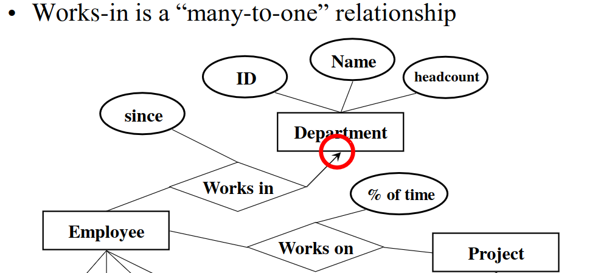
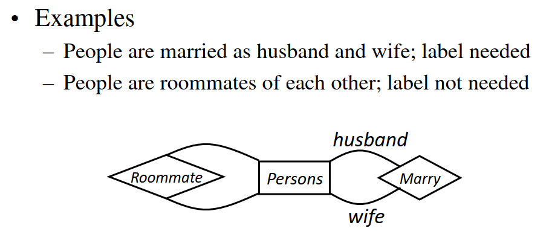

# Lec 3 ER

* An attribute for which each entity has to have a unique value is called a key attribute (like ssn)
  * Cannot be null

* Arrows used to signify many to one. An arrow pointing to a box signifies many to whatever the arrow is pointing to 

* Many employees work in a department
* Labels are also sometimes needed for specification

## Subclass

* Special case: has fewer entities and more properties
* Ex: Engineer is a type of employee
  * Every engineer is an employee but not every employee is an engineer
  * Engineer also has an attribute clearance
  * ISA points to superclass and is denoted by a triangle
  * 
  * There would be two tables, Employee and engineer
    * The engineer table would have two attributes ID and clearance
    * The employee table would have everything except clearance
    * The engineer would appear twice 
  * **If an entity is in a subclass, it is in all superclasses only the root entity has a key and it works for all entities**

## Weak entity sets

* Used when entity does not have a global key value
* Ex:
  * In basketball, you need team + player number to identify a player 
  * Players would be the weak entity since it depends on something else for an identifier
  * Denoted by double square
  * Many players to one team

## Design principles
* Reduce redundancy (storage and needing to update many places)
* Limit use of weak entity sets (use regular attributes)
* 