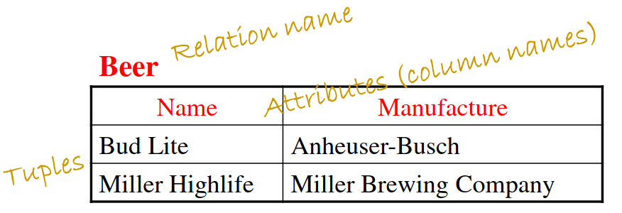

# Lec 4

## What is a data model 

* Structural data
  * Represent data using math
  * relational model - graphs

## Relational model
* Highly effecient
* used to handle very large scale data
* Set of relations 
* NOT considered ordered
* Each relation is a table
  * Rows: Tuples or records
  * Columns: attributes 

* schema: Specifies name of relation, plus name and type of each column
  * Ex: Students (sid: string, name: string, login: string, age: integer, gpa: real)
  * Name (attribute_name: type, attribute_name: type)
* Attributes: Columns
  * Variables of the class essentially
* Instance: A table with rows and columns
  * Rows = cardinality
  * fields = degree 
  * (112, Bart, 18, 3.2)
* Tuples: The rows of the relation (excludes header row)
* Domain: Allowed values for each attribute
* Constraints: Conditions that hold all valid instances, 3 types
    1. Domain constraints: Value of attribute has to be from domain (A cannot be in GPA)
    2. Key constraints: 2 can't have the same key, every table must have a primary key and the primary key cannot be NULL
    3. Referential Integrity Constraints, an element must exist elsewhere.
	    ![[Pasted image 20240130130250.png]]

## Keys
* Set of attributes is a candidate key if 
    1. No two tuples can have the same values in all key fields and
    2. This is not true for any subset of the key
    * For example, if the VIN is the candidate key then so is VIN + color
* Set of all attributes is a superkey 
* Superkey is also any set of attributes that are unique
* Minimal superkey is the candidate key because it is the least keys needed to be a superkey
* If there is multiple unique keys (candidate keys) then one of the keys is manually chosen to be the primary key
* Multiple candidate keys together makes a superkey not a candidate key
* Foreign Key:
	* Fields in a relation that refers to a tuple in another relation kind of like a logical pointer
### Term recap
* Table = relation
* Column = attribute
* Row = tuple
* Possible vals = Domain
* Table definition = Schema
* Populated table = Instances 
