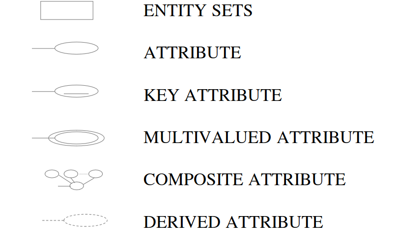
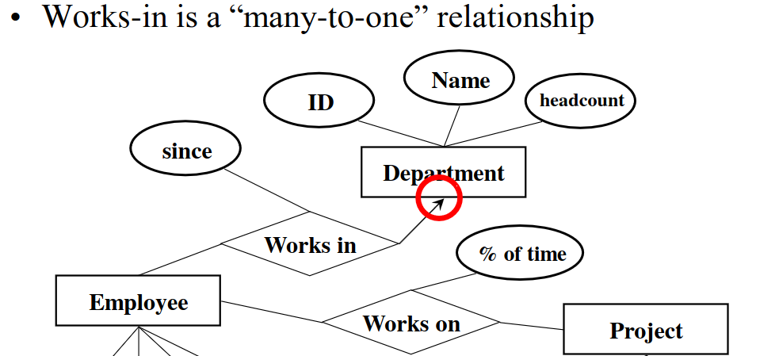
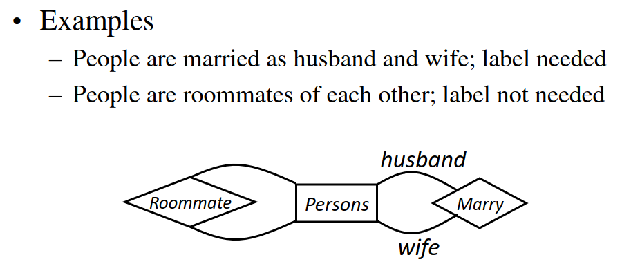
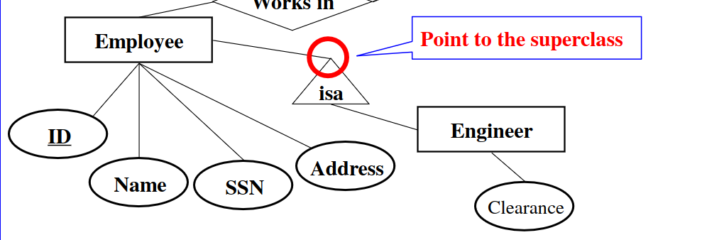
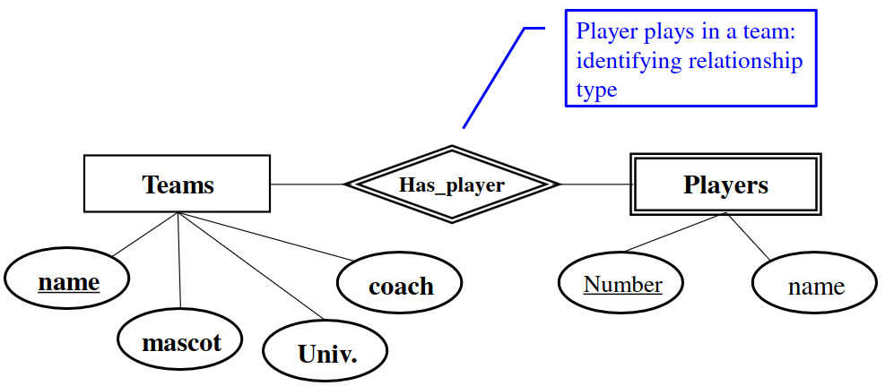
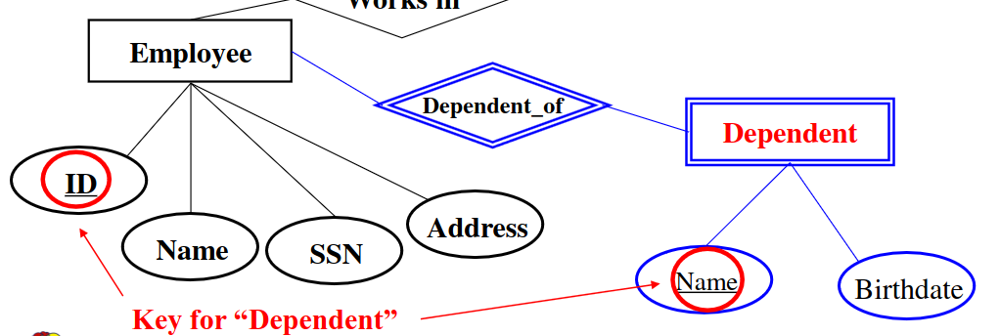

# Lec 3

## What is a database? 

* Large, interconnected set of data
* Data: facts that can be measured and recorded
* DBMS: Enables uses to create and maintain databases
  * Allow specification of schemas
  * Query and modify big data   

## Database design
* Conceptual design: Sketch the design
* Used to model reality
  
## E/R Model
* Most common model to describe the world
* High level
* ABout entity sets and relationships
  * Entity Set: Collection of similar entities [Rectangles used]
  * Entity: SPecific object in the mini-world
    * Attributes: property of an object (Simple values like vars) [Circles Used]
* Relationships connection between entity sets
  * Relates distinct entities with different meanings 
  * Grouped into relationship types
  * Portrayed by diamonds

## Attribute
* SImple: Single attomic value (Sex. SSN) 
* Composite: Composed of different components (name) [circle from other circle]
* Single value: At most one value (SSN)
* Multivalued: Multiple values (classes)
* Stored: Information that is stored and doesn't change unless more information is given (name)
* Derived: Information that changes automatically (grade, age)
* NULL Values: Empty values (no middle name, no address)
* An attribute for which each entity has to have a unique value is called a key attribute (like ssn)
  * Cannot be null
## Summary

## Frequency
* Arrows used to signify many to one. An arrow pointing to a box signifies many to whatever the arrow is pointing to 

* Many employees work in a department
* Labels are also sometimes needed for specification

## Subclass

* Special case: has fewer entities and more properties
* Ex: Engineer is a type of employee
  * Every engineer is an employee but not every employee is an engineer
  * Engineer also has an attribute clearance
  * ISA points to superclass and is denoted by a triangle
  * 
  * There would be two tables, Employee and engineer
    * The engineer table would have two attributes ID and clearance
    * The employee table would have everything except clearance
    * The engineer would appear twice 
  * **If an entity is in a subclass, it is in all superclasses only the root entity has a key and it works for all entities**

## Weak entity sets

* Used when entity does not have a global key value
* Ex:
  * In basketball, you need team + player number to identify a player 
  * Players would be the weak entity since it depends on something else for an identifier
  * Denoted by double square
  * Many players to one team

## Design principles
* Reduce redundancy (storage and needing to update many places)
* Limit use of weak entity sets (use regular attributes)
* 