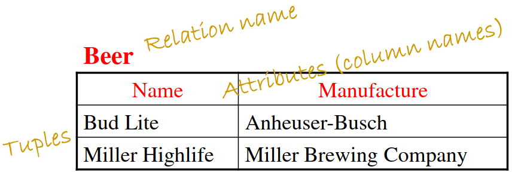

# What is a data model 

* Structural data
  * Represent data using math
  * relational model - graphs

# Relational model
* Highly effecient
* used to handle very large scale data
* Set of relations 
* NOT considered ordered
* Each relation is a table
  * Rows: Tuples or records
  * Columns: attributes 

* schema: Specifies name of relation, plus name and type of each column
  * Ex: Students (sid: string, name: string, login: string, age: integer, gpa: real)
  * Name (attribute_name: type, attribute_name: type)
* Attributes: Columns
  * Variables of the class essentially
* Instance: A table with rows and columns
  * Rows = cardinality
  * fields = degree 
  * (112, Bart, 18, 3.2)
* Tuples: The rows of the relation (excludes header row)
* Domain: Allowed values for each attribute
* Constraints: Conditions that hold all valid instances, 3 types
    1. Domain constraints: Value of attribute has to be from domain (A cannot be in GPA)
    2. Key constraints: 2 can't have the same key, every table must have a primary key and the primary key cannot be NULL
    3. Referential Integrity Constraints, an element must exist elsewhere.
	    ![[Pasted image 20240130130250.png]]

# Keys
* Set of attributes is a candidate key if 
    1. No two tuples can have the same values in all key fields and
    2. This is not true for any subset of the key
    * For example, if the VIN is the candidate key then so is VIN + color
* Set of all attributes is a superkey 
* Superkey is also any set of attributes that are unique
* Minimal superkey is the candidate key because it is the least keys needed to be a superkey
* If there is multiple unique keys (candidate keys) then one of the keys is manually chosen to be the primary key
* Multiple candidate keys together makes a superkey not a candidate key
* Foreign Key:
	* Fields in a relation that refers to a tuple in another relation kind of like a logical pointer
## Term recap
* Table = relation
* Column = attribute
* Row = tuple
* Possible vals = Domain
* Table definition = Schema
* Populated table = Instances 

# Keys Part 2
* Super key: 
	* key(s) that can uniquely indentify a row on a table
	* Can be many
	* Can consist of 1+ attributes
	* Can have redundant attributes
		* Ex: SSN and haircolor are one superkey but just ssn is also a superkey
* Candidate Key
	* Super key but no redundant attributes
	* One attribute only not a tuple
	* There can be multiple candidate keys but each candidate key can only be one attribute
		* Ex: Phone Number and SSN are unique and can be candidate keys
* Primary Key
	* One of the candidate keys that is chosen by the user
* Foreign key
	* A key that is used to refer to a tuple (row) in another relation
	* All SID in 'enrolled' table must line up with one in the 'students' table

## Other info
* It is good practice to merge 1:1 relationships into one table
* Or use a foreign key that is a total participant
* For weak entity sets borrow a key from the superclass
* You want the relationship to have the key 
	* So WorksOn would have the key in this spot ![[Pasted image 20240201144738.png]]
	
# Translating to table
Entity set translates directly to a table
	Attributes --> columns
	Key attributes --> Primary Key]

Composite attributes are flattened into one for simplicity
relationship relation: the table that connects the 2 relationships
## Multivalued attributes
When translating ER model to actual relational database, multivalued attributes can't be represented directly
A new table is created with the primary key from the original entity as the foreign key so that it is linked
## 1:1 relationships
Sometimes merged into one because it is easier
Or, the entity type with total participation is chosen as the foreign key
	Total participation is when one entity has to be connected to another entity for it to exist
Generally, a new class has to be created that connects the two classes together. The new class is called the relationship relation
![[Pasted image 20240206123141.png]]
## 1:N
Can either create a new class for the relationship relation
Or in the many class use the primary key of the one class as a foreign key
![[Pasted image 20240206123532.png]]
## M:N
Use multiple candidate keys because to find the unique one you need both elements
![[Pasted image 20240206124054.png]]![[Pasted image 20240207122616.png]]

## Weak Entity set
Must write the primary key that it is borrowing as a candidate key
Make sure no name overlap
![[Pasted image 20240207122511.png]]
