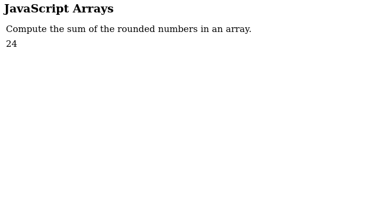

// Const numbers array
const numbers = [15.5, 2.3, 1.1, 4.7];
// Get the element with the ID "demo" and change the html to be the sum of all the numbers
// The reduce uses the getSum function on each element of the array (starting from 0) and adds them to a running total to get the sum
document.getElementById("demo").innerHTML = numbers.reduce(getSum, 0);

// The function inputs a total and a number and outputs the sum
function getSum(total, num) {
    // Returns the first param + the second param
    return total + Math.round(num);
}

